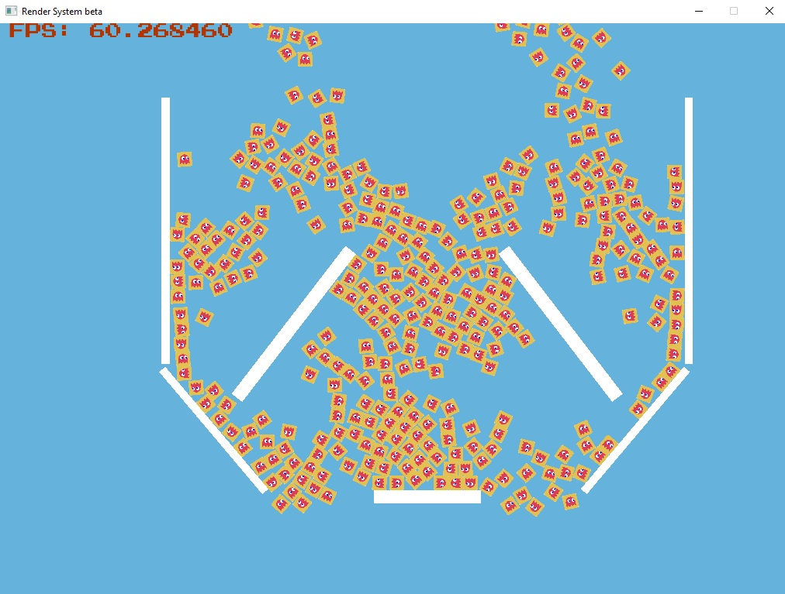

# ECS
Entity Component System
The repository contains an education-training project that is an entity-component-system (ECS) implementation, for a simple physics engine in two dimensions. ECS follows the principle of composition over inheritance.  Every entity is defined  by the components that are associated with it. Entities are composed from components of data are handled by systems - process which acts on all entities with the desired components.

For instance, this project implements physics system to deal with 2D body motion and render system (based on OpenGL) which allows you to display two-dimensional objects on the screen. The physics solver allows simulating the motion of rigid bodies in two dimensions, taking into account collisions and friction.
Project served as a playground for implementation of design patterns such as object factory, state pattern, observer/visitor pattern or command pattern.

